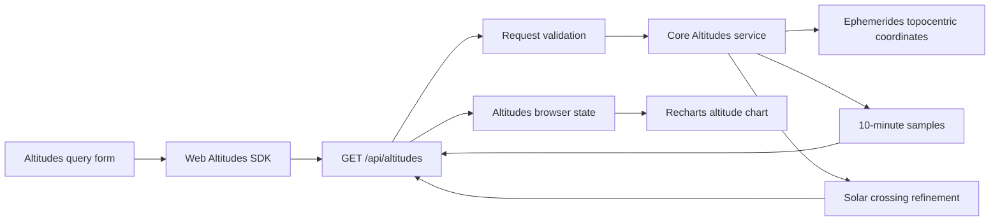

# Planet altitude chart implementation plan

## Goal

Implement the story in [2-planet-altitude.md](2-planet-altitude.md) end to end: reusable altitude and solar-event calculations, an authenticated REST endpoint, a typed web client, an Altitudes page, and automated coverage.

## Decisions carried into implementation

The plan assumes the product decisions in the story are accepted:

- All timestamps are entered, transmitted, plotted, and displayed in UTC.
- Sun, Moon, Mercury, Venus, Mars, Jupiter, Saturn, Uranus, and Neptune are the only supported targets and are all selected initially.
- Samples are generated every 10 minutes for a maximum range of 7 days.
- The response includes the exact start and end instants.
- Solar thresholds are `-0.833 deg`, `-6 deg`, `-12 deg`, and `-18 deg`.
- Event times are refined until the containing bracket is at most 60 seconds wide.

No new runtime dependency is required. Component tests will require `@testing-library/react`, `@testing-library/user-event`, and `jsdom` as web development dependencies because the web package currently has Vitest configuration but no DOM component-test utilities.

## Architecture



### Ownership boundaries

- `packages/core` owns target-independent sampling and astronomical event calculations. It does not know about API Gateway or JSON.
- `packages/functions` owns query-string parsing, supported-target enforcement, HTTP validation behavior, full-kernel construction, and the wire response.
- `packages/web` owns form validation, UTC input serialization, API transport, result states, and chart presentation.
- `infra/api.ts` owns route registration and authentication.

## Data model

### Core types

Add the following exported types under `packages/core/src/astro/scripts/altitudes/`:

```ts
export const ALTITUDE_TARGET_NAMES = [
  'Sun',
  'Moon',
  'Mercury',
  'Venus',
  'Mars',
  'Jupiter',
  'Saturn',
  'Uranus',
  'Neptune',
] as const;

export type AltitudeTargetName = typeof ALTITUDE_TARGET_NAMES[number];

export type SolarEventType =
  | 'sunrise'
  | 'sunset'
  | 'civilDawn'
  | 'civilDusk'
  | 'nauticalDawn'
  | 'nauticalDusk'
  | 'astronomicalDawn'
  | 'astronomicalDusk';

export type AltitudeSample = {
  tde: Date;
  altitudes: Record<string, number>;
};

export type SolarEvent = {
  type: SolarEventType;
  tde: Date;
};

export type AltitudesResult = {
  samples: AltitudeSample[];
  solarEvents: SolarEvent[];
};
```

Use a readonly target descriptor table to map each supported name to its `JplBodyId`. Keep this allowlist separate from the much broader JPL body catalogue so unsupported bodies cannot enter the service through the endpoint.

`AltitudeSample.altitudes` is keyed by requested target name. Runtime construction must add every requested target exactly once. The API tests will enforce this invariant.

### Wire types

The Lambda returns core `Date` values. `JSON.stringify` serializes them as ISO 8601 strings. The web SDK must define explicit wire types with `tde: string` rather than importing a core type containing `Date`; this avoids the unsound date typing used by some older SDK modules.

```ts
export type AltitudeSampleDto = {
  tde: string;
  altitudes: Record<AltitudeTargetName, number>;
};

export type SolarEventDto = {
  type: SolarEventType;
  tde: string;
};
```

The record is partial at compile time because a response contains only selected targets:

```ts
altitudes: Partial<Record<AltitudeTargetName, number>>;
```

## Phase 1: Core altitude service

### Files

Create:

- `packages/core/src/astro/scripts/altitudes/index.ts`
- `packages/core/src/astro/scripts/altitudes/Altitudes.ts`
- `packages/core/src/astro/scripts/altitudes/SolarEvents.ts`
- `packages/core/src/astro/scripts/altitudes/__tests__/Altitudes.test.ts`
- `packages/core/src/astro/scripts/altitudes/__tests__/SolarEvents.test.ts`

Modify:

- `packages/core/src/astro/scripts/index.ts`

### Sampling implementation

Implement an `Altitudes` class constructed with `KernelsRepository`, following `Ephemerides`:

```ts
class Altitudes {
  constructor(kernels: KernelsRepository);

  compute(
    targets: readonly AltitudeTarget[],
    fromEs: number,
    toEs: number,
    observer: ObserverLocation,
  ): AltitudesResult;
}
```

Implementation steps:

1. Validate internal preconditions defensively: at least one target, unique target names, finite bounds, and `fromEs < toEs`. API-specific limits remain in the handler.
2. Build one `Ephemerides.buildFullCoordinatesFunction` closure per selected body. Do not reconstruct the ephemeris or topocentric frame for every sample.
3. Build one Sun coordinate closure for event detection. Reuse the selected Sun closure when Sun is selected.
4. Generate ephemeris-second timestamps beginning at `fromEs`, increasing by exactly 600 seconds while less than `toEs`, then append `toEs` unless already present. This guarantees both inclusive endpoints and prevents a duplicate aligned endpoint.
5. At each timestamp, call each selected closure, convert `azAltCoords.altitude` from radians with `Radians.toDegrees`, and create one sample.
6. Use the same coarse timestamps and Sun closure to bracket all threshold crossings.
7. Return samples and events sorted by time.

Do not call `computeFullEphemeridesWithVelocity`: it calculates range, angular size, equatorial coordinates, and velocity that this endpoint does not return. Initially reuse `buildFullCoordinatesFunction` as required by the story; if profiling shows its range/angular-size work is material, add a narrowly scoped `buildAzAltCoordinatesFunction` to `Ephemerides` and cover it against the existing full-coordinate result.

### Solar-event implementation

Keep threshold metadata in one readonly table:

| Threshold | Rising event | Setting event |
|---:|---|---|
| `-0.833` | `sunrise` | `sunset` |
| `-6` | `civilDawn` | `civilDusk` |
| `-12` | `nauticalDawn` | `nauticalDusk` |
| `-18` | `astronomicalDawn` | `astronomicalDusk` |

Factor crossing detection and refinement into functions that accept an altitude callback. This makes the numerical behavior testable without loading JPL kernels:

```ts
type AltitudeAt = (es: number) => number; // degrees

findSolarEvents(
  sampleTimes: readonly number[],
  altitudeAt: AltitudeAt,
): SolarEventAtEphemerisSecond[];
```

For every adjacent coarse pair and threshold:

1. Compute signed offsets `leftAltitude - threshold` and `rightAltitude - threshold`.
2. A rising crossing changes from negative to zero/positive; a setting crossing changes from positive to zero/negative.
3. Use half-open interval ownership so a value exactly equal to a threshold at a coarse timestamp produces one event, not one event in each neighboring interval.
4. Ignore a tangent that touches a threshold without changing sides because it has no rising or setting crossing.
5. Bisect the bracket, retaining the half that contains the sign change, until its width is at most 60 seconds.
6. Use the midpoint of the final bracket as the event timestamp.
7. Select dawn/rise versus dusk/set from the original crossing direction.
8. Deduplicate equal event type/timestamp pairs defensively and sort all thresholds chronologically.
9. Filter the final events to the inclusive request bounds.

Cache Sun altitude at coarse sample times. Bisection evaluations may use a small per-request `Map<number, number>` so the four thresholds do not repeat identical midpoint calculations.

### Core tests

Use pure synthetic altitude functions for deterministic numerical tests:

- Sampling includes start and end when the range is aligned to 10 minutes.
- Sampling appends one final end sample when the range is not aligned.
- A one-day range produces 145 samples.
- Every sample contains exactly the requested target keys.
- Altitudes are converted from radians to degrees.
- Sun is calculated for events when it is not a selected output target.
- Rising and setting crossings map to the correct event names at all four thresholds.
- A refined crossing lies within 60 seconds of a known synthetic root.
- An exact threshold at a coarse timestamp produces one event.
- A tangent and a constant-above/constant-below function produce no event.
- Multiple thresholds are returned in chronological order.
- A polar-style no-crossing period returns an empty event array.

Add one integration-style test using `@jpl/data/kernels.testData` that compares a generated altitude to `Ephemerides.fullCoordinates(...).azAltCoords.altitude` for the same body, time, and observer.

### Phase validation

Run:

```bash
npm test --workspace albedo-core -- --run src/astro/scripts/altitudes
npm run typecheck --workspace albedo-core
```

## Phase 2: REST endpoint and infrastructure

### Files

Create:

- `packages/functions/src/altitudes/getAltitudes.ts`
- `packages/functions/src/altitudes/getAltitudes.test.ts`
- `packages/functions/src/altitudes/index.ts`

Modify:

- `packages/functions/src/index.tsx` if this barrel is used for function type exports
- `infra/api.ts`

### Request parsing and validation

Export `parseGetAltitudesParams` for focused unit tests. Parse the six mandatory query parameters and validate before constructing the core service.

Validation order:

1. Report a missing mandatory parameter.
2. Split `targets` on commas and trim delimiter-adjacent whitespace while retaining case sensitivity.
3. Reject an empty list, empty entries, duplicates, and names outside `ALTITUDE_TARGET_NAMES`.
4. Parse dates with `parseISO`; reject invalid dates using `isValid` and reject timestamps without an explicit `Z` UTC designator. The web always sends `Date.toISOString()` values.
5. Parse latitude, longitude, and altitude; reject all non-finite values rather than accepting `NaN` from `mandatoryFloat`.
6. Require latitude in `[-90, 90]`, longitude in `[-180, 180]`, and altitude `>= 0`, matching `ObserverLocationFields`.
7. Require `fromTde < toTde`.
8. Require `toTde - fromTde <= 7 * 24 * 60 * 60 * 1000`.

Do not put the core calculation in the validation `try/catch`. Convert only known parsing/validation failures to `Failure(message)` so they become HTTP 400. Let unexpected kernel or calculation failures escape to `lambdaHandler`, which preserves HTTP 500 behavior.

Suggested structure:

```ts
export const getAltitudes = (event: APIGatewayProxyEvent) => {
  let params: GetAltitudesParams;
  try {
    params = parseGetAltitudesParams(event);
  } catch (error) {
    return Failure(error instanceof Error ? error.message : String(error));
  }

  const result = new Altitudes(kernels).compute(/* converted params */);
  return Success(result);
};

export const handler = lambdaHandler<AltitudesResult>(getAltitudes);
```

Convert request dates to ephemeris seconds with the existing `JulianDay`/`EphemerisSeconds` utilities consistently with current handlers.

### Route registration

In `infra/api.ts`, register:

```ts
route("GET /api/altitudes", "packages/functions/src/altitudes/getAltitudes.handler");
```

The existing route helper automatically applies Cognito authorization, 1024 MB memory, and a 30-second timeout. Keep the route before `api.deploy()`.

### Handler tests

Mock the core service or full kernels for request-contract tests so validation tests remain fast. Cover:

- A valid request returns HTTP 200, ISO UTC strings, ordered samples/events, CORS headers, and all requested target keys.
- Sun events are present when Sun is omitted from `targets`.
- Every missing parameter returns HTTP 400.
- Empty, duplicate, unknown, and incorrectly cased targets return HTTP 400.
- Invalid/non-UTC dates, equal/reversed dates, and a range over 7 days return HTTP 400.
- `NaN`, `Infinity`, and out-of-range observer fields return HTTP 400.
- An unexpected core error remains HTTP 500.

If direct service mocking is awkward because the service is instantiated in the module, export a `createGetAltitudes(serviceFactory)` handler factory and keep `handler` wired to the real full-kernel factory. This is preferable to loading production kernels in every validation test.

### Phase validation

Run:

```bash
npm test --workspace albedo-functions -- --run src/altitudes
npm run typecheck --workspace albedo-functions
npm run typecheck
```

Run `sst diff --stage <development-stage>` before deployment and confirm the diff contains one new authenticated `GET /api/altitudes` method and Lambda integration, with no changes to existing methods or authorizers.

## Phase 3: Web SDK

### Files

Create:

- `packages/web/src/sdk/Altitudes.ts`
- `packages/web/src/sdk/Altitudes.test.ts`

### SDK contract

Export:

```ts
export type AltitudesQuery = {
  targets: AltitudeTargetName[];
  fromTde: string;
  toTde: string;
  location: Location;
};

export type AltitudesResponse = {
  samples: AltitudeSampleDto[];
  solarEvents: SolarEventDto[];
};
```

Implement `getAltitudes` with Amplify's `get`, following `sdk/Eclipses.ts`:

- Path: `/api/altitudes`.
- Serialize targets with `join(',')` in selected-list order.
- Serialize coordinates with `.toString()`.
- Pass the already-normalized ISO UTC timestamps unchanged.
- Parse and cast the body to `AltitudesResponse`.

Add a small runtime response guard if current SDK conventions permit it. At minimum, verify `samples` and `solarEvents` are arrays before returning, so malformed successful responses become the page's API error state rather than a render exception.

### SDK tests

Mock `aws-amplify/api` and verify the path/query string, including target ordering and location fields. Test malformed response rejection if the runtime guard is added.

## Phase 4: Altitudes page and form

### Files

Create:

- `packages/web/app/routes/altitudes.tsx`
- `packages/web/src/components/Altitudes/AltitudesBrowser.tsx`
- `packages/web/src/components/Altitudes/AltitudesQueryForm.tsx`
- `packages/web/src/components/Altitudes/AltitudesChart.tsx`
- `packages/web/src/components/Altitudes/AltitudeTooltip.tsx`
- `packages/web/src/components/Altitudes/SolarEventLabel.tsx`
- `packages/web/src/components/Altitudes/altitudeChartConfig.ts`
- `packages/web/src/components/Altitudes/AltitudesQueryForm.test.tsx`
- `packages/web/src/components/Altitudes/AltitudesChart.test.tsx`

Modify:

- `packages/web/app/routes.ts`
- `packages/web/src/layouts/Navigation.tsx`
- `packages/web/package.json`
- `packages/web/vitest.config.ts`

### Route and navigation

- Add `route('altitudes', 'routes/altitudes.tsx')` near Ephemeris.
- Add `{ link: '/altitudes', label: 'Altitudes' }` to the shared `menuItems`; both desktop and mobile menus consume this list.
- Render `AltitudesBrowser` inside `MainLayout` with title `Altitudes`.

### UTC form state

Do not copy the existing `format(date, "...Z")` pattern: it formats local clock fields and only appends a literal `Z`.

Use UTC date-time strings as form state in `yyyy-MM-ddTHH:mm` form:

1. Round `Date.now()` down to a 10-minute UTC boundary.
2. Derive initial start with `roundedDate.toISOString().slice(0, 16)`.
3. Derive initial end from start plus 24 hours.
4. Render MUI `TextField` controls with `type="datetime-local"` and labels `Start (UTC)` and `End (UTC)`.
5. Parse a non-empty value by appending `:00.000Z`; serialize the parsed date with `toISOString()`.

This keeps displayed fields in UTC without adding a timezone library. MUI's DateFns-backed picker represents JavaScript `Date` values in the browser timezone and therefore cannot guarantee the story's UTC input semantics by label alone.

### Form controls

- Use MUI `Select` with `multiple`, `Checkbox` menu items, and stable `ALTITUDE_TARGET_NAMES` ordering.
- Render selected values as a comma-separated list; let the control wrap on small screens rather than expanding beyond its grid cell.
- Use the existing `ObserverLocationFields` and initial location `{ latitude: 51, longitude: 17, altitude: 50 }`, unless profile-backed defaults are introduced separately.
- Use `QueryPanel` and `QuerySubmit` for consistent request feedback.

Compute form validity from current state on every render:

- At least one target.
- Both UTC strings parse to finite dates.
- Start is before End.
- Difference is no more than 7 days.
- Location fields are valid according to `useValidation`.

Show inline helper text on both date fields for invalid/reversed/oversized ranges. Disable Submit when invalid or loading; `QuerySubmit` already displays its loading state.

### Browser state

`AltitudesBrowser` owns `AltitudesResponse | undefined` and uses `useQuery`.

Wrap the fetch function so it clears the previous result before awaiting the SDK call:

```ts
async function fetchData(query: AltitudesQuery) {
  setResult(undefined);
  return getAltitudes(query);
}
```

This prevents stale data from remaining during a replacement request and after a failed request without changing shared query behavior for existing pages.

Render states explicitly:

- `undefined`: no chart before the first successful query, while loading, or after failure.
- `samples.length === 0`: an informational empty-result alert.
- Non-empty samples and no events: chart normally, with no event markers and no warning required.
- Non-empty samples and events: chart plus markers.

### Component-test setup

Add web development dependencies:

```bash
npm install --workspace albedo-web --save-dev @testing-library/react @testing-library/user-event jsdom
```

Add `"test": "vitest"` to `packages/web/package.json`, then configure `packages/web/vitest.config.ts` with `environment: 'jsdom'` for component tests. If global browser mocks are needed, add a focused setup file for `ResizeObserver`, which Recharts' `ResponsiveContainer` expects. Do not globally mock Recharts behavior that the chart tests need to inspect.

## Phase 5: Chart implementation

### Numeric time axis

Do not use the existing categorical `DateAxisTick` directly. Solar-event timestamps generally fall between 10-minute samples; a Recharts `ReferenceLine` on a categorical axis will not reliably render a value absent from the sample categories.

Transform samples to:

```ts
{
  timestamp: Date.parse(sample.tde),
  Sun?: number,
  Moon?: number,
  // selected targets
}
```

Configure:

- `XAxis` with `dataKey="timestamp"`, `type="number"`, `domain={['dataMin', 'dataMax']}`, and UTC tick formatting.
- `YAxis` with `domain={[-90, 90]}`, degree units, and a stable width.
- A horizontal `ReferenceLine y={0}` labeled `Horizon`.
- One `Line` per key present in the first sample, ordered by `ALTITUDE_TARGET_NAMES`.
- `dot={false}` to keep up to 1,009 points per series readable.
- A stable color map with nine visually distinct colors that work on the current MUI background.
- A clickable `Legend` and a `Set<AltitudeTargetName>` of hidden series, following `EphemerisCharts`.

Use `ResponsiveContainer` inside a box with stable responsive dimensions, for example a minimum height on mobile and an aspect ratio/max height on larger screens. Ensure the legend has reserved vertical space so it does not resize the plot when labels wrap.

### UTC tooltip and ticks

Use `Intl.DateTimeFormat` with `timeZone: 'UTC'` for all display formatting. Include `UTC` in the tooltip timestamp. Format altitude values with `toFixed(2)` and `deg`.

Select x-axis tick detail based on the requested duration:

- Up to 48 hours: month/day plus hour/minute UTC.
- Longer ranges: month/day plus hour UTC.

Avoid parsing/display through browser-local `date-fns` helpers.

### Event markers

For each event:

- Render a vertical `ReferenceLine x={Date.parse(event.tde)}`.
- Use stable event colors or line styles grouped by threshold while retaining readable labels.
- Map API names to display labels such as `Civil dawn`.
- Stagger labels through a deterministic lane index, for example `index % 3`, so adjacent markers do not share the same y position.
- Render labels with a custom SVG `SolarEventLabel` and a nested `<title>` containing the full event name and UTC timestamp for hover accessibility.
- Clip or suppress only the visible short label near chart edges; do not suppress the line or accessible title.

### Chart tests

With a fixed-size `ResizeObserver` mock and representative DTO fixtures, verify:

- One named line is created for every selected target.
- The fixed `-90` to `90` y-axis and horizon reference are configured.
- Event reference lines exist at timestamps between sample timestamps.
- All eight event labels map correctly.
- Tooltip formatting is UTC and uses two decimal places.
- Clicking a legend entry hides and restores the corresponding series.
- Empty events render without an error.
- Empty samples are handled by `AltitudesBrowser`, not passed into the chart.

Prefer accessible labels/test IDs on the chart wrapper and event labels where SVG output is otherwise brittle. Avoid assertions against Recharts-generated class names.

## Phase 6: End-to-end coverage

### Files

Create:

- `packages/web/tests/e2e/altitudes.spec.ts`

Optionally add a dedicated mobile project to `playwright.config.ts`; otherwise set the viewport in the mobile test with `page.setViewportSize`.

### Stable test strategy

Use Playwright route interception for most page behavior tests. This makes chart and validation tests deterministic and avoids API throttling, authentication latency, current-time drift, and full-kernel cost. Keep one authenticated real-API smoke test if the deployed test environment is available.

Test cases:

1. Navigation exposes Altitudes on desktop and mobile and opens `/altitudes`.
2. Initial form has all nine targets selected and an approximately 24-hour UTC range.
3. Empty targets, reversed dates, a range over 7 days, and invalid location values show inline errors and disable Submit.
4. A mocked successful response renders target lines, the horizon, and all supplied event markers.
5. Legend interaction hides and restores a series.
6. A successful response with no events still renders the lines.
7. A successful response with no samples shows the empty-result state.
8. A failed API request shows the error and removes the previous chart.
9. At a mobile viewport, controls, selected values, legend, chart, and event labels remain within the viewport and do not overlap incoherently.
10. The real endpoint smoke test submits a short fixed UTC interval and confirms a non-empty chart.

Add stable `aria-label` values to form fields and the chart container so tests do not depend on MUI DOM internals.

## Phase 7: Full validation and review

Run focused checks first after each implementation phase, then the repository suite:

```bash
npm test --workspace albedo-core -- --run src/astro/scripts/altitudes
npm test --workspace albedo-functions -- --run src/altitudes
npm test --workspace albedo-web -- --run src/components/Altitudes src/sdk/Altitudes.test.ts
npm run typecheck --workspace albedo-core
npm run typecheck --workspace albedo-functions
npm run typecheck --workspace albedo-web
npm test
npm run build
```

For end-to-end tests, start or deploy the application using the repository's SST workflow, set `TEST_BASE_URL`, then run:

```bash
npm run test:e2e -- --grep "Altitudes"
```

Before completion:

- Run the existing Ephemeris core tests and `packages/web/tests/e2e/ephemeris.spec.ts` to catch regressions in shared topocentric calculations and chart conventions.
- Inspect `sst diff` to ensure only the new route/Lambda and expected site build changes are introduced.
- Use Playwright screenshots at desktop and mobile viewport sizes to inspect form wrapping, chart sizing, legend wrapping, UTC labels, and event-label collisions.
- Confirm the longest 7-day/all-target request completes inside the 30-second Lambda timeout and produces at most 1,009 samples, 9,081 altitude values, and the expected small event list.

## Delivery sequence

Implement as reviewable vertical commits or pull-request checkpoints, without deploying an incomplete public route:

1. Core service, exports, and numerical tests.
2. Lambda endpoint, validation tests, and infrastructure route.
3. Web SDK, form, route, and result states.
4. Chart, event annotations, and component tests.
5. End-to-end tests, responsive review, performance check, and documentation updates.

Register the infrastructure route in the same checkpoint as the handler, but deploy only after the frontend can consume it or behind a non-production SST stage.

## Risks and mitigations

| Risk | Mitigation |
|---|---|
| Event markers do not align between samples | Use a numeric timestamp x-axis, not the existing categorical date axis. |
| UTC controls silently use browser-local time | Store UTC wall-clock strings and append `Z` explicitly; do not format local `Date` fields with a literal `Z`. |
| Exact-threshold samples create duplicate events | Give crossings half-open interval ownership and add exact-root tests. |
| Polar day/night is treated as an error | Return an empty event array and render samples normally. |
| Validation errors become HTTP 500 | Catch only parsing/validation failures and return `Failure`; leave calculation errors to `lambdaHandler`. |
| Previous chart remains after a failed replacement query | Clear browser result before awaiting each request. |
| Full-range requests exceed Lambda limits | Enforce 7 days server-side, reuse coordinate closures, cache Sun evaluations, and benchmark the maximum request. |
| Recharts tests are brittle in jsdom | Mock dimensions only and assert accessible wrappers/labels rather than generated classes. |
| Target lists diverge across layers | Export one core allowlist/type and consume it in functions and web through existing TypeScript path aliases. |
| API wire dates are typed as `Date` in the browser | Define explicit DTOs with ISO strings in the SDK. |

## Definition of done

- Every acceptance criterion in `2-planet-altitude.md` has an automated test or a documented responsive/performance verification.
- Core calculations are exported through `@astro/scripts` and do not depend on Lambda or React code.
- `GET /api/altitudes` is authenticated and returns HTTP 400 for all specified invalid requests.
- The page uses UTC consistently and displays no stale chart after loading or failure.
- All eight solar event types render at arbitrary timestamps between samples.
- Core, functions, web type checks, unit/component tests, build, focused E2E tests, and existing ephemeris regression tests pass.
- The maximum supported query completes within the deployed Lambda timeout.
