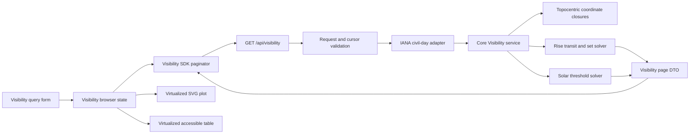

# Planet visibility chart implementation plan

## Goal

Implement [3-planet-visibility.md](3-planet-visibility.md) end to end: reusable daily rise, upper-transit, set, and solar-phase calculations; an authenticated paged API; a typed web client; a responsive and accessible Visibility chart; and automated coverage.

The finished page must support inclusive civil-date ranges of up to ten complete calendar years. The default query covers January 1 through December 31 of the current year in the selected IANA time zone. Dates increase from top to bottom, so January appears above December and later years appear below earlier years.

## Decisions carried into implementation

This plan treats the confirmed story decisions as requirements:

- The horizontal axis is local wall-clock time from `00:00` to `24:00` in a selectable IANA time zone.
- The vertical axis is civil date in ascending order from top to bottom.
- The default range is the full current calendar year in the selected time zone.
- The maximum range is ten complete calendar years: `toDate` must be earlier than `addYears(fromDate, 10)`.
- Moon, Mercury, Venus, Mars, Jupiter, Saturn, Uranus, and Neptune are supported and selected initially.
- Rise and set use geometric topocentric altitude crossing `0 deg`.
- Highest altitude is the highest interior upper culmination in the civil day. A below-horizon transit is retained and visually muted.
- At most one rise, upper transit, and set is returned for each object and civil date.
- Solar thresholds remain `-0.833 deg`, `-6 deg`, `-12 deg`, and `-18 deg`.
- Event timestamps are refined until their containing interval is no wider than 60 seconds.
- Legend filtering is included; zoom and brush controls are not included in the MVP.

The story leaves the following choices open. This plan selects concrete defaults:

- Add `date-fns-tz` to `albedo-functions` and `albedo-web`. Civil-day conversion belongs at the API boundary, while the core calculation remains time-zone agnostic and receives UTC ephemeris-second intervals.
- Reuse the altitude target allowlist from `packages/core/src/astro/scripts/altitudes/Altitudes.ts`; do not create a second list of supported bodies.
- Page calculation by civil date. The user submits one range, but the browser retrieves and appends bounded pages automatically. This is required because ten years of all targets is too risky for one Lambda execution and one response payload.
- Use pages of at most 93 civil days. A full year therefore needs four requests and ten years needs at most forty requests. Confirm the final page size with the Phase 1 benchmark before freezing it as a constant.
- Keep `GET /api/visibility` and add an optional `cursor` query parameter. The first response and every continuation response return `nextCursor`; the browser hides this transport detail.
- Render only the visible date window plus overscan. Use `@tanstack/react-virtual` for row virtualization unless the chart spike proves a small local fixed-row virtualizer simpler and equally accessible.
- Use a purpose-built SVG plot for each virtualized date block rather than Recharts. Recharts is suitable for the existing fixed-height Altitudes chart, but it does not naturally support thousands of virtualized date rows, split-at-midnight paths, sticky axes, or keyboard-addressable event points.

## Architecture



### Ownership boundaries

- `packages/core` owns astronomical event detection and refinement in ephemeris seconds. It must not depend on IANA time zones, API Gateway, JSON, or React.
- `packages/functions` owns civil-date parsing, IANA time-zone conversion, ten-year and page bounds, cursor integrity, full-kernel construction, and wire serialization.
- `packages/web` owns browser-zone defaults, form validation, automatic page retrieval, cancellation and stale-query protection, chart geometry, virtualization, interaction, and accessible presentation.
- `infra/api.ts` owns authenticated route registration and Lambda resource settings.

## Phase 0: Performance and chart spikes

Complete these probes before committing to the page size or plot implementation. Keep useful benchmark fixtures as tests; discard throwaway UI code.

### Calculation benchmark

Add a temporary benchmark around `Ephemerides.buildFullCoordinatesFunction` using full kernels and one representative observer. Measure:

- One object and the Sun over 93 days.
- All eight objects and the Sun over 93 days.
- Coarse intervals of 30, 60, and 120 minutes.
- Total coordinate evaluations, refinement evaluations, wall time, and peak memory.

Start with a 60-minute coarse interval. Rise/set and a daily altitude maximum cannot normally appear and disappear between adjacent hourly samples without being bracketed, but tests must cover the fast-moving Moon and high-latitude observers. If hourly sampling is not reliable, use 30 minutes for the Moon and 60 minutes for other bodies rather than applying the expensive interval globally.

The benchmark gate is that a maximum-size page with all targets completes comfortably inside the deployed Lambda timeout at p95, leaving at least 30% headroom. Reduce the page size if it does not.

### Plot spike

Build a local fixture containing 366 dates, all targets, all event types, solar phases, missing-event gaps, and midnight wraps. Verify that a virtualized SVG implementation can:

- Keep the hour header and date labels aligned while scrolling.
- Render only visible rows plus overscan.
- Draw continuous paths within the mounted date block.
- Preserve continuity visually at virtual block boundaries.
- Expose focusable event points and usable tooltips.
- Render at existing Playwright desktop and mobile viewport sizes without overlap.

If custom SVG accessibility or geometry becomes disproportionate, evaluate a canvas plot with a synchronized semantic table. Canvas is the fallback, not the initial implementation, because SVG event points provide better keyboard and screen-reader integration.

## Phase 1: Shared core calculation primitives

### Files

Create:

- `packages/core/src/astro/scripts/visibility/Visibility.ts`
- `packages/core/src/astro/scripts/visibility/ObjectEvents.ts`
- `packages/core/src/astro/scripts/visibility/visibilityTypes.ts`
- `packages/core/src/astro/scripts/visibility/index.ts`
- `packages/core/src/astro/scripts/visibility/__tests__/ObjectEvents.test.ts`
- `packages/core/src/astro/scripts/visibility/__tests__/Visibility.test.ts`

Modify:

- `packages/core/src/astro/scripts/index.ts`
- `packages/core/src/astro/scripts/altitudes/SolarEvents.ts`
- `packages/core/src/astro/scripts/altitudes/__tests__/SolarEvents.test.ts`
- `packages/core/src/astro/scripts/ephemeris/Ephemerides.ts` if the performance probe justifies an altitude-only closure

### Core types

Keep civil dates and local plotting minutes out of core types. The core receives explicit UTC intervals and returns physical events in ephemeris seconds:

```ts
export type VisibilityInterval = {
  key: string;
  fromEs: number;
  toEs: number;
};

export type TimedObjectEvent = {
  es: number;
};

export type TransitEvent = TimedObjectEvent & {
  altitude: number;
};

export type ObjectEvents = {
  rise: TimedObjectEvent | null;
  transit: TransitEvent | null;
  set: TimedObjectEvent | null;
};

export type VisibilityIntervalResult = {
  key: string;
  objects: Partial<Record<AltitudeTargetName, ObjectEvents>>;
  solar: {
    phaseAtStart: SolarPhase;
    events: SolarEventAtEphemerisSecond[];
  };
};
```

`key` is opaque to core. The function layer supplies the ISO civil date and uses it to associate each result with its requested day.

### Reusable altitude closure

Initially reuse `Ephemerides.buildFullCoordinatesFunction` and convert `azAltCoords.altitude` with `Radians.toDegrees`, matching Altitudes exactly.

If Phase 0 shows range and angular-size calculation is material, add:

```ts
buildAzAltCoordinatesFunction(
  bodyId: JplBodyId,
  observer: ObserverLocation,
): (es: number) => AzAltCoordinates;
```

Implement it from the existing parallax-corrected position function and topocentric frame. Add a regression test comparing its output with `buildFullCoordinatesFunction(...).azAltCoords` for every supported body at representative times and locations before switching either Altitudes or Visibility to it.

### Generalize crossing refinement

Extract the threshold-independent parts of `findSolarEvents` into a reusable numeric crossing helper while preserving the current solar API:

```ts
findThresholdCrossings(
  sampleTimes: readonly number[],
  valueAt: (es: number) => number,
  threshold: number,
): { direction: 'rising' | 'setting'; es: number }[];
```

Requirements:

- Cache evaluations by ephemeris second.
- Give exact-threshold roots half-open ownership so they appear once.
- Ignore tangencies without a sign change.
- Refine with bisection to a bracket of at most 60 seconds.
- Keep `findSolarEvents` as a thin mapping over four thresholds so the Altitudes public contract does not change.

### Continuous coarse scan

Do not restart a complete coarse scan for each civil day. For every selected target:

1. Build one coordinate closure for the entire page.
2. Build a sorted union of coarse timestamps covering all supplied UTC intervals, including every interval boundary.
3. Evaluate and cache altitude once per timestamp.
4. Detect all `0 deg` crossings across the page.
5. Assign each refined crossing to the half-open interval `[fromEs, toEs)` containing it.
6. Select the first rising crossing and first setting crossing in an interval. Record additional candidates in test diagnostics; the public result remains one event per type.

Build the Sun closure once per page and use the same timestamp/evaluation cache for all four solar thresholds.

### Upper-transit calculation

Use altitude maxima because no direct topocentric hour-angle or transit function exists in the repository:

1. Locate strict sampled maxima where the middle altitude exceeds both neighbours.
2. Refine each bracket by minimizing negative altitude with `findLocalMinimumByGoldenSection` from `packages/core/src/astro/math/extremums/`.
3. Configure `maxResultRangeWidth: 60` seconds and enough iterations to reach it from the coarse bracket.
4. Keep only refined maxima in `[fromEs, toEs)`; never promote an interval boundary to a transit.
5. If several maxima occur in one civil interval, return the one with the greatest altitude and use earliest timestamp as a deterministic tie-breaker.
6. Return an interior maximum even when its altitude is below `0 deg`.

Evaluate the Moon-specific coarse interval from Phase 0. Add a test proving that a fast-moving lunar maximum is not skipped.

### Solar phase at interval start

Export the solar threshold table and a pure `solarPhaseAt(altitudeDegrees)` function from the existing solar module. For each interval, evaluate the Sun exactly at `fromEs` and return one of `day`, `civilTwilight`, `nauticalTwilight`, `astronomicalTwilight`, or `night`. This makes polar full-day rendering explicit even when there are no crossings.

### Core tests

Use synthetic functions for numerical behavior and small-kernel integration tests for astronomy:

- Rising and setting `0 deg` crossings map correctly and refine within 60 seconds.
- An exact root belongs to one interval only.
- An event at `toEs` belongs to the following interval.
- A tangent does not produce rise or set.
- Missing rise and set produce explicit `null` values.
- Golden-section refinement finds a known maximum within 60 seconds.
- Boundary maxima are not reported as transits.
- Multiple maxima choose the highest, then earliest.
- A below-horizon maximum is retained.
- A circumpolar synthetic object has transit but no rise or set.
- A never-rising synthetic object has a below-horizon transit but no rise or set.
- Solar phase-at-start covers all five phases.
- Polar-day and polar-night functions return no solar crossings with the correct starting phase.
- Interval results and object keys preserve requested order.
- Coordinate evaluations are cached and remain below an asserted bound.
- Full-coordinate integration tests cover Moon, an inner planet, and an outer planet at normal and high latitudes.

### Phase validation

```bash
npm test --workspace albedo-core -- --run src/astro/scripts/visibility src/astro/scripts/altitudes
npm run typecheck --workspace albedo-core
```

## Phase 2: Civil-day adapter and paged API

### Dependencies

Install `date-fns-tz` in `albedo-functions`. Keep it out of core because core receives absolute intervals.

### Files

Create:

- `packages/functions/src/visibility/CivilDays.ts`
- `packages/functions/src/visibility/VisibilityCursor.ts`
- `packages/functions/src/visibility/getVisibility.ts`
- `packages/functions/src/visibility/getVisibility.test.ts`
- `packages/functions/src/visibility/CivilDays.test.ts`
- `packages/functions/src/visibility/index.ts`

Modify:

- `packages/functions/package.json`
- `packages/functions/src/index.tsx` only if the existing barrel requires it
- `infra/api.ts`

### Civil-date conversion

`CivilDays.ts` owns the conversion from requested dates to half-open UTC intervals:

1. Parse `fromDate` and `toDate` strictly as `yyyy-MM-dd`; reject normalization such as February 30 becoming a March date.
2. Validate `timeZone` as an IANA identifier by converting a known instant and catching invalid-zone errors.
3. Iterate calendar dates without converting them to fixed 24-hour durations.
4. Convert local `00:00` for each date and its successor to UTC with `date-fns-tz`.
5. Assert that each interval is positive and permit 23-hour, 24-hour, and 25-hour intervals.
6. Convert UTC dates to ephemeris seconds with `EphemerisSeconds.fromDateTimeObject`.

Add explicit fixtures for `Europe/Warsaw` spring-forward and fall-back dates, a leap day, and a zone without daylight saving.

### Request validation

Export `parseGetVisibilityParams` and follow the validation style in `getAltitudes.ts`:

1. Require `targets`, `fromDate`, `toDate`, `timeZone`, `latitude`, `longitude`, and `altitude`.
2. Split, trim, case-check, deduplicate, and map targets through `ALTITUDE_TARGETS`.
3. Strictly parse both calendar dates.
4. Require `fromDate <= toDate`.
5. Reject `toDate >= addYears(fromDate, 10)`. Thus `2026-01-01` through `2035-12-31` is valid and `2026-01-01` through `2036-01-01` is invalid.
6. Validate the IANA zone.
7. Require finite latitude, longitude, and altitude; enforce the existing observer bounds.
8. Validate an optional continuation cursor against the immutable query fields.

Only parsing and expected validation errors become HTTP 400 through `Failure`. Let unexpected kernel and calculation failures reach `lambdaHandler` as HTTP 500.

### Pagination contract

Retain the story's daily DTO and extend the response:

```ts
export type VisibilityResponse = {
  timeZone: string;
  fromDate: string;
  toDate: string;
  days: VisibilityDayDto[];
  nextCursor: string | null;
};
```

The request's optional `cursor` identifies the first date of the next page. Use a URL-safe base64 JSON payload containing:

- Cursor version.
- Next civil date.
- Hash of targets, original date bounds, time zone, and observer coordinates.

Sign the cursor with an application secret only if clients must not be able to alter page position. For this read-only calculation endpoint, strict decoding plus query-hash validation is sufficient unless the deployment already has a cursor-signing convention. Never accept a cursor date outside the original range.

For each page:

- Return at most `VISIBILITY_PAGE_DAYS`, initially 93.
- Include dates in ascending order.
- Return every requested target exactly once per day.
- Represent absent rise, transit, and set as `null`.
- Convert event `es` to ISO UTC `tde`.
- Compute `minuteOfDay` from the event instant in the selected zone, including seconds as a fraction.
- Return the UTC offset or an unambiguous zoned display value for repeated daylight-saving times. Add `utcOffsetMinutes` to each event DTO rather than making the browser infer it.
- Set `nextCursor` to `null` after the inclusive `toDate` is returned.

`minuteOfDay` remains wall-clock based. A repeated local time can produce the same minute value twice, while `tde` and `utcOffsetMinutes` distinguish the instants.

### Handler test matrix

Cover:

- Valid one-day, full-year, leap-year, and ten-year requests.
- The first page, middle continuation, final partial page, and `nextCursor: null`.
- Cursor reuse with altered targets, location, time zone, or bounds returns HTTP 400.
- Missing, malformed, duplicate, unsupported, and incorrectly cased targets.
- Invalid dates, normalized invalid dates, reversed dates, valid maximum range, and rejected tenth-anniversary end.
- Valid and invalid IANA zones.
- `NaN`, `Infinity`, and out-of-range observer values.
- A DST spring day has a 23-hour UTC interval and a fall day has a 25-hour interval.
- UTC strings, local minutes, UTC offsets, target keys, event nullability, ordering, and solar phase serialization.
- Unexpected service errors remain HTTP 500.

### Infrastructure

Register:

```ts
route("GET /api/visibility", "packages/functions/src/visibility/getVisibility.handler");
```

Start with the existing authenticated route conventions and 1024 MB memory. Benchmark 1024 MB against 2048 MB because Lambda CPU scales with memory; choose the lower-cost configuration that satisfies the page latency gate. If the repository route helper still applies a 30-second timeout, keep it unless measured pages require a documented increase.

### Phase validation

```bash
npm test --workspace albedo-functions -- --run src/visibility
npm run typecheck --workspace albedo-functions
npm run typecheck
```

Run `sst diff --stage <development-stage>` and verify that it adds only the authenticated visibility method, Lambda integration, and any intentional memory setting.

## Phase 3: Shared presentation configuration and web SDK

### Dependencies

Add to `albedo-web`:

- `date-fns-tz` for browser-zone defaults and zoned labels.
- `@tanstack/react-virtual` if selected by the Phase 0 plot spike.

Add `@testing-library/react`, `@testing-library/user-event`, and `jsdom` as development dependencies if they are still absent when implementation starts.

### Files

Create:

- `packages/web/src/common/charts/astronomyChartConfig.ts`
- `packages/web/src/sdk/Visibility.ts`
- `packages/web/src/sdk/Visibility.test.ts`
- `packages/web/src/components/Visibility/visibilityTypes.ts`

Modify:

- `packages/web/src/components/Altitudes/AltitudesChart.tsx`
- `packages/web/src/components/Altitudes/altitudeTypes.ts`
- `packages/web/package.json`
- `packages/web/vitest.config.ts` if DOM tests need an environment entry

### Shared chart configuration

Move stable object colors, solar phase colors, solar phase names, and event transition metadata out of `AltitudesChart.tsx`. Both pages must import the same constants. Preserve current Altitudes colors exactly to avoid an unrelated visual regression.

Do not move Altitudes-specific Recharts behavior into the shared module. Share semantic values only.

### SDK wire types

Define explicit DTOs with ISO strings rather than importing core types containing ephemeris seconds or `Date` values:

```ts
export type VisibilityEventDto = {
  tde: string;
  minuteOfDay: number;
  utcOffsetMinutes: number;
};

export type VisibilityTransitDto = VisibilityEventDto & {
  altitude: number;
};

export type VisibilityObjectDayDto = {
  rise: VisibilityEventDto | null;
  transit: VisibilityTransitDto | null;
  set: VisibilityEventDto | null;
};
```

Represent `objects` as `Partial<Record<AltitudeTargetName, VisibilityObjectDayDto>>` at compile time because only requested targets are present.

### Automatic paginator

Implement two SDK layers:

- `getVisibilityPage(query, cursor?, signal?)` performs one Amplify request and validates the response shape.
- `iterateVisibilityPages(query, signal?)` is an async generator that follows `nextCursor` until complete.

The browser can display the first page immediately and append later pages. Guard against repeated cursors and dates that are missing, duplicated, or out of order. Treat malformed pages as API errors.

Use `AbortController` where Amplify permits it. If Amplify's operation exposes cancellation differently, wrap that mechanism behind the SDK so a replacement query stops pending continuation requests.

### Phase validation

```bash
npm test --workspace albedo-web -- --run src/sdk/Visibility src/components/Altitudes
npm run typecheck --workspace albedo-web
```

## Phase 4: Route, query form, and browser state

### Files

Create:

- `packages/web/app/routes/visibility.tsx`
- `packages/web/src/components/Visibility/VisibilityBrowser.tsx`
- `packages/web/src/components/Visibility/VisibilityQueryForm.tsx`
- `packages/web/src/components/Visibility/VisibilityQueryForm.test.tsx`
- `packages/web/src/components/Visibility/VisibilityBrowser.test.tsx`

Modify:

- `packages/web/app/routes.ts`
- `packages/web/src/layouts/Navigation.tsx`

### Route and navigation

- Add `route('visibility', 'routes/visibility.tsx')` beside Altitudes.
- Add `{ link: '/visibility', label: 'Visibility' }` to the shared navigation list so desktop and mobile menus receive it.
- Render `VisibilityBrowser` inside `MainLayout` with title `Visibility`.

### Form defaults

On first render:

1. Read `Intl.DateTimeFormat().resolvedOptions().timeZone`.
2. Fall back to `UTC` only if the result is absent or invalid.
3. Determine the current year in that zone, not from browser-local or UTC year fields.
4. Set `fromDate` to January 1 and `toDate` to December 31 of that year.
5. Select all `ALTITUDE_TARGET_NAMES`.
6. Reuse `ObserverLocationFields` and its current defaults and validation flow.

Use MUI `DatePicker` controls because the inputs are civil dates, not instants. Use an editable/selectable IANA zone control. Start with the browser zone selected and provide at least UTC plus zones already entered during the session; avoid shipping a manually maintained incomplete zone list. If supported browsers expose `Intl.supportedValuesOf('timeZone')`, use it with a guarded fallback.

### Client validation

- Require at least one target.
- Require valid start and end dates with `fromDate <= toDate`.
- Require `toDate < addYears(fromDate, 10)` using calendar arithmetic.
- Require a valid IANA zone.
- Reuse observer validation.
- Disable controls that would cause ambiguous state changes while the first page is loading; allow a user to submit a replacement query after the current request can be cancelled.

### Incremental browser state

Maintain explicit states for `idle`, `loadingFirstPage`, `loadingMore`, `complete`, and `error`.

- Clear stale data before starting a replacement query.
- Assign each submission a generation ID so a late response from an old query cannot append to a new result.
- Render after the first page arrives.
- Append only ordered, non-overlapping pages.
- Show loaded-date progress while continuation pages are running.
- On a continuation failure, keep already loaded dates visible with a retry action and an incomplete-result warning. A first-page failure uses the standard query error and shows no chart.
- Do not issue forty requests concurrently. Fetch sequentially by default; consider a concurrency of two only after load testing confirms it respects API throttling. The current infrastructure throttle of one request per second makes sequential retrieval the safe default.

### Form and state tests

- Defaults are January 1 and December 31 in the selected zone, including a browser instant near a UTC year boundary.
- Changing zone recalculates defaults only before the user edits dates; it must not silently replace an intentional range.
- Exactly ten complete years is allowed and the tenth anniversary is rejected.
- Empty targets and invalid observer values block submission.
- First page renders before completion.
- Continuation pages append in order.
- Replacement queries discard late old pages.
- Continuation failure preserves partial data and retry resumes from the failed cursor.
- First-page failure clears old results.

### Phase validation

```bash
npm test --workspace albedo-web -- --run src/components/Visibility/VisibilityQueryForm src/components/Visibility/VisibilityBrowser
npm run typecheck --workspace albedo-web
```

## Phase 5: Chart data geometry

### Files

Create:

- `packages/web/src/components/Visibility/visibilityGeometry.ts`
- `packages/web/src/components/Visibility/visibilityGeometry.test.ts`
- `packages/web/src/components/Visibility/solarBands.ts`
- `packages/web/src/components/Visibility/solarBands.test.ts`

### Coordinate model

Use logical chart coordinates independent of pixels:

- `x` is `minuteOfDay` in `[0, 1440]`.
- `y` is the zero-based date index, increasing downward.
- One row spans from `index - 0.5` to `index + 0.5`.
- Pixel conversion belongs to the plot component and uses the current viewport width and fixed row height.

### Object path construction

Create pure path builders before writing SVG components:

1. Build a separate logical track for each `(target, eventType)` pair.
2. Break the path whenever either adjacent date lacks that event.
3. Connect only date indices differing by exactly one.
4. If the absolute minute difference is at most 720, connect directly.
5. If it exceeds 720, treat the time as circular. Interpolate the crossing point against an unwrapped endpoint, end one segment at `1440`, and begin the continuation at `0` at the same interpolated vertical coordinate.
6. Preserve event points separately from line geometry for focus and tooltips.
7. Mark transit points with altitude below zero as muted without removing them from geometry or the table.

Unit-test direct segments, both midnight directions, exact `00:00`, missing days, non-consecutive pages, year boundaries, and virtual-window boundaries.

### Solar band construction

For each day:

1. Begin at `minuteOfDay = 0` with `phaseAtStart`.
2. Sort and validate solar events.
3. Emit horizontal phase intervals between transitions.
4. End the final interval at `1440`.

Construct the hourglass boundaries by connecting matching event boundaries on adjacent dates. Break and cap polygons when a crossing is missing or when the phase occupies the entire day. Split polygons at midnight using the same circular interpolation principle as object tracks. Favor correctness of per-row phase fill over forced continuity in polar transition cases.

Tests must cover an ordinary day, phase spanning midnight, polar day, polar night, twilight-only day, missing threshold levels, DST repeated minutes, and transitions into and out of no-crossing periods.

### Phase validation

```bash
npm test --workspace albedo-web -- --run src/components/Visibility/visibilityGeometry src/components/Visibility/solarBands
npm run typecheck --workspace albedo-web
```

## Phase 6: Virtualized chart and accessible table

### Files

Create:

- `packages/web/src/components/Visibility/VisibilityChart.tsx`
- `packages/web/src/components/Visibility/VisibilityPlot.tsx`
- `packages/web/src/components/Visibility/VisibilityLegend.tsx`
- `packages/web/src/components/Visibility/VisibilityTooltip.tsx`
- `packages/web/src/components/Visibility/VisibilityTable.tsx`
- `packages/web/src/components/Visibility/VisibilityChart.test.tsx`
- `packages/web/src/components/Visibility/VisibilityTable.test.tsx`

### Layout

- Put the form above an unframed chart section; do not nest cards.
- Use a sticky horizontal hour axis at the top of the scroll viewport.
- Keep date labels in a fixed-width left gutter synchronized with virtual rows.
- Use a stable row height between 6 and 12 pixels for the plot, selected during the spike. Add larger invisible hit targets around visible event markers without changing layout.
- Label January 1, each month boundary, and the final date by default. On shorter ranges, increase label density; on mobile, reduce it.
- Add stronger horizontal rules at month and year boundaries.
- Render solar bands first, grid lines second, object paths third, and focus/hover points last.
- Disable decorative animation for initial and appended pages. Appending data must not shift already rendered rows.

### Legend and filtering

Render two compact control groups:

- Object color swatches toggle all tracks for that object.
- Rise, transit, and set controls show marker and line style and toggle that type across objects.

Use buttons with `aria-pressed`, not passive legend text. Ensure filtered objects are also filtered from the accessible table.

### Tooltip and focus

For each event point expose:

- Object.
- Rise, highest altitude, or set.
- Civil date.
- Zoned local time to the nearest minute, including offset/abbreviation.
- UTC timestamp.
- Transit altitude and `below horizon` when applicable.

Mouse hover and keyboard focus use the same tooltip content. Escape closes a pinned tooltip. Focus order follows date, object order, then rise/transit/set, while virtualization retains only focusable points in the mounted window.

### Accessible data table

Provide a collapsible table synchronized with visible object/event filters. Virtualize table rows independently for long ranges. Each row represents one date and object and includes rise, highest altitude, transit altitude, and set. Missing events use text such as `Does not rise` or `No set on this date`, not a bare dash.

The table is the complete nonvisual representation; SVG path descriptions alone are not sufficient.

### Empty and partial states

- If a response contains dates but no selected object event, keep the solar chart visible and show an informational message.
- If only some events are absent, render available tracks without a global warning; the table communicates each absence.
- If no days are returned from a successful first page, show an invalid-response error because a valid non-empty inclusive date range must return at least one day.
- During continuation loading, show progress without covering or disabling the loaded chart.

### Component tests

Assert semantic behavior rather than generated SVG path formatting where possible:

- January is above December and later years are below earlier years.
- Hour ticks run from `00:00` to `24:00`.
- Only visible rows plus overscan are mounted for a ten-year fixture.
- Sticky axis and date gutter remain present.
- Object and event filters update plot and table.
- Line style and marker shape distinguish event types.
- Below-horizon transits are muted and labeled.
- Missing events break tracks.
- Polar phase fills render without crossings.
- Keyboard focus exposes the same values as pointer tooltip.
- Partial loading and retry states preserve rendered pages.

### Phase validation

```bash
npm test --workspace albedo-web -- --run src/components/Visibility
npm run typecheck --workspace albedo-web
npm run build --workspace albedo-web
```

## Phase 7: End-to-end and operational verification

### Files

Create:

- `packages/web/tests/e2e/visibility.spec.ts`
- Focused fixtures or route mocks under `packages/web/tests/utils/` following existing conventions

### End-to-end scenarios

Cover:

1. Navigation from desktop and mobile menus.
2. Current-year defaults with January at top and December at bottom.
3. A normal mid-latitude year with all five solar phases.
4. Legend filtering by object and event type.
5. Tooltip and keyboard access to event details.
6. A rise or set track wrapping across midnight without a long cross-chart segment.
7. Circumpolar and never-rising objects with explicit missing events.
8. Polar day and polar night backgrounds.
9. A DST spring-forward and fall-back date with correct wall-clock labels and UTC offsets.
10. Incremental loading, continuation retry, and replacement-query stale-response protection.
11. A mocked ten-year response proving virtualization and year ordering without requiring the E2E suite to perform forty astronomical Lambda calls.
12. Desktop and mobile screenshots with no overlapping form, legends, axes, tooltip, or table controls.

### Numerical reference verification

For a small set of dates and locations, compare rise, transit, set, and solar events with an independent trusted ephemeris or precomputed fixtures. Set tolerances according to this story's geometric `0 deg` object horizon and `-0.833 deg` solar threshold; do not compare object events with a source that silently applies refraction or body semidiameter.

Record fixture provenance and threshold assumptions next to the test data.

### Performance verification

Measure in an SST development stage:

- p50 and p95 Lambda duration for a full 93-day/all-target page.
- Memory peak and response size.
- Full current-year time to first page and time to completion.
- Ten-year sequential retrieval time under the configured one-request-per-second throttle.
- Browser main-thread responsiveness, mounted DOM node count, and scroll behavior for 3,653 days.

Acceptance gates:

- First page renders before the browser request timeout and with at least 30% Lambda timeout headroom.
- No page approaches API Gateway/Lambda payload limits.
- The ten-year chart mounts a bounded number of rows and event points independent of total result length.
- Scrolling and legend filtering do not produce long tasks that make interaction visibly stall.

Run:

```bash
npm run test:e2e -- --grep "Visibility"
npm test
npm run typecheck
npm run build
```

Also rerun the Altitudes E2E test and core altitude tests because the implementation shares target constants, solar transitions, colors, and potentially the altitude-only coordinate closure.

## Delivery sequence

Deliver in reviewable checkpoints without exposing an incomplete production route:

1. Calculation and plot performance spikes with recorded decisions.
2. Generic crossing helper, Visibility core service, and numerical tests.
3. Civil-day adapter, paged handler, contract tests, and infrastructure route.
4. Shared chart semantics, SDK paginator, form, route, and incremental browser state.
5. Pure chart geometry and solar band tests.
6. Virtualized plot, legend, tooltips, accessible table, and component tests.
7. E2E coverage, reference-data verification, performance tuning, and documentation updates.

Register the API route with the handler checkpoint, but deploy it only to a development stage until the frontend consumes pagination and all maximum-page performance gates pass.

## Risks and mitigations

| Risk | Mitigation |
|---|---|
| A ten-year request exceeds Lambda time or response limits | Page by civil date, benchmark maximum pages, and append pages automatically in the browser. |
| Sequential pagination is slow under the one-request-per-second API throttle | Render the first page immediately, use the largest measured safe page, and show progress; revisit route-specific throttling only with load evidence. |
| Hourly samples skip a lunar or high-latitude event | Benchmark and test adversarial cases; use a 30-minute Moon interval if required. |
| Daily maxima are confused with interval boundaries | Refine only bracketed interior sampled maxima and never substitute `00:00` or `24:00`. |
| Exact-midnight events appear on two dates | Use half-open `[fromEs, toEs)` ownership and test both API serialization and path geometry. |
| DST days are treated as fixed 24-hour intervals | Generate boundaries from consecutive local midnights with `date-fns-tz`. |
| Repeated wall-clock times are ambiguous | Return UTC timestamp and UTC offset with `minuteOfDay`; show the offset in tooltips and the table. |
| Polar days are inferred incorrectly from missing events | Return `phaseAtStart` explicitly and build each row's intervals from that state. |
| Tracks draw across the chart when crossing midnight | Build circular-time geometry with split segments at `1440` and `0`. |
| Missing days are visually interpolated | Require adjacent date indices and break every track at null or absent data. |
| Custom SVG becomes inaccessible | Make event points focusable and provide a complete virtualized semantic table. |
| Thousands of rows freeze the browser | Virtualize plot and table, disable animation, and test bounded DOM counts with a ten-year fixture. |
| Continuation from an old query corrupts new results | Use cancellation plus submission generation IDs and validate every page's bounds/order. |
| Shared Altitudes colors or solar behavior regress | Extract semantic constants without changing values and rerun Altitudes tests and screenshots. |
| Full-coordinate evaluation is too expensive | Add and regression-test an altitude-only Ephemerides closure only after benchmark evidence. |

## Definition of done

- Every acceptance criterion in [3-planet-visibility.md](3-planet-visibility.md) has an automated test or a documented visual/performance verification.
- Core event calculations are exported through `@astro/scripts` and have no Lambda, IANA time-zone, or React dependency.
- `GET /api/visibility` is authenticated, validates all inputs and cursors, and returns ordered bounded pages with explicit null events and solar starting phases.
- The form defaults to the current calendar year in the browser IANA zone and enforces the ten-calendar-year boundary on both client and server.
- January renders above December, dates increase downward, and later years render below earlier years.
- Object tracks break on missing dates and split correctly at midnight.
- Solar backgrounds handle ordinary twilight, phases spanning midnight, polar day, polar night, and DST days.
- Long results render incrementally with bounded DOM size and remain keyboard accessible through event points and a semantic table.
- Core, functions, and web type checks; focused and full unit tests; production build; Visibility E2E tests; and Altitudes regression tests pass.
- Maximum-page Lambda duration, payload size, full-year completion, and ten-year browser performance are measured and meet the documented gates.